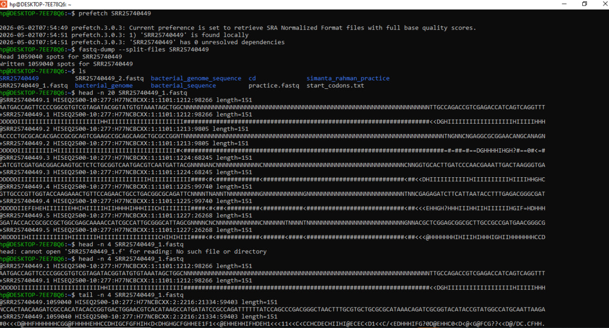
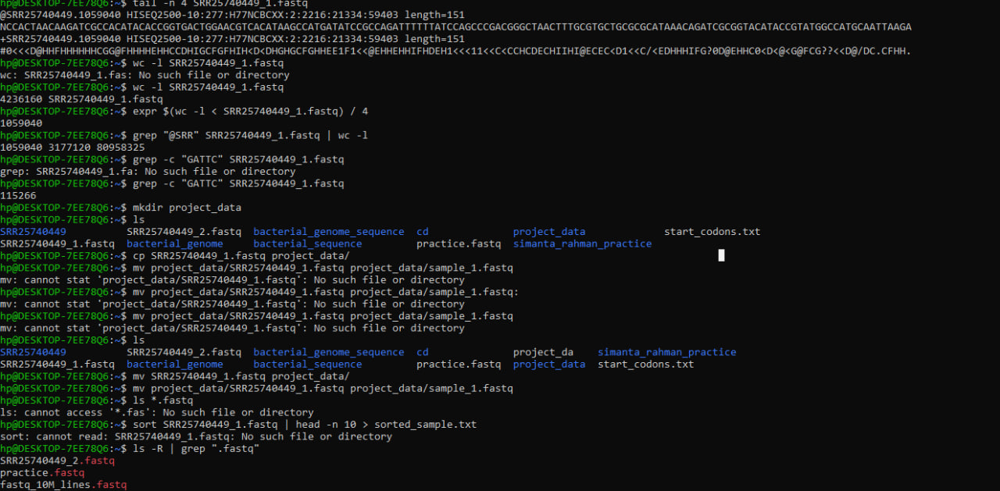
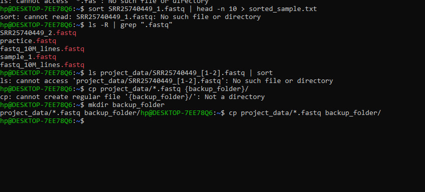

# Metagenomic Data Processing & Linux Workflow Practice

This repository serves as a technical log for my hands-on experience with real-world metagenomic datasets. The primary focus of this session was navigating the Linux command-line interface to manage NCBI sequence data and resolving the standard "bottlenecks" encountered in bioinformatics pipelines.

## Project Context
As part of my foundation in **Environmental Microbiology**, I am developing a workflow to handle raw genomic data. This specific exercise involved the end-to-end process of pulling raw SRA objects, converting them into analysis-ready FASTQ formats, and performing initial sequence-level audits.

## Data Source
*   **Accession ID:** `SRR25740449`
*   **Platform:** Illumina HiSeq 2500
*   **Context:** This is an authentic dataset retrieved from the **NCBI SRA database**. Working with high-fidelity, real-world data is a prerequisite for my research in soil microbial communities.

---

## Technical Workflow & Toolset

### 1. Data Retrieval & Format Conversion
I utilized the **SRA Toolkit** for the initial data acquisition phase:
*   `prefetch SRR25740449`: Fetches the compressed SRA data from NCBI.
*   `fastq-dump --split-files SRR25740449`: Decompresses and splits the data into paired-end files (`_1.fastq` and `_2.fastq`).

### 2. File Exploration & Inspection
Standard Linux binary utilities were used to verify file content and structure:
*   **`ls` & `cat`**: Verified file presence and inspected metadata.
*   **`*` (Wildcard)**: Used for batch processing sequencing files.
*   **`head` & `tail`**: Inspected FASTQ headers and Phred quality scores to ensure data integrity.

### 3. Data Manipulation
*   **`mkdir`, `cp`, `mv`**: Structured the workspace into `project_data/` and `backup_folder/`.
*   **`sort` & Piping (`|`)**: Chained commands to filter and organize sequence identifiers efficiently.

---

## Troubleshooting & Engineering Insights

Bioinformatics is as much about troubleshooting as it is about analysis. Below are the key hurdles cleared during this session:

*   **Pathing & Context Awareness:** Encountered "No such file" errors after moving data to sub-folders. This reinforced that wildcards like `*` are context-dependent. I now routinely use `pwd` to orient my scripts.
*   **Syntax Strictness:** Resolved execution failures caused by minor typos in file extensions (e.g., `.fa` vs `.fastq`). I've adopted **Tab Completion** as a mandatory habit.
*   **Directory Prerequisites:** Learned that destination directories must be explicitly created with **`mkdir`** before any `cp` or `mv` operations.
*   **SRA Caching:** Identified that the SRA Toolkit utilizes local caching, which optimizes bandwidth by skipping redundant downloads.

---

## Technical Logs & Practice Screenshots

### 1. Data Acquisition and Quality Check

### 2. Sequence Manipulation and Motif Counting

### 3. Workflow Troubleshooting

---
**Author:** **Md. Simanta Rahman**  
**Focus:** **Environmental Microbiology & Metagenomics** 
